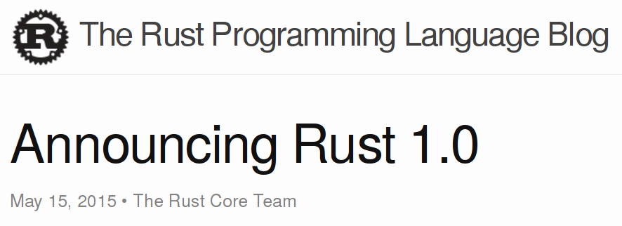
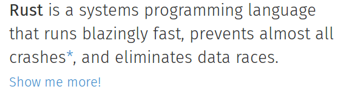
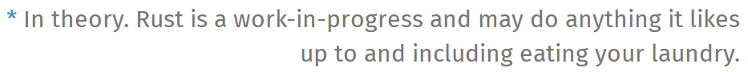
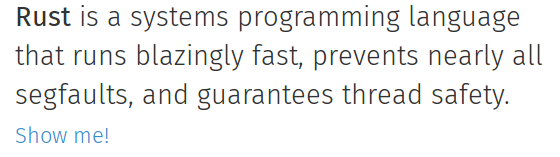

% Rust 1.0

<h1></h1>

<table id="stats">
<tr><th><small>Approximately…</small></th><th></th></tr>
<tr><td class="num">8</td><td class="thing">years</td></tr>
<tr><td class="num">230</td><td class="thing">RFCs</td></tr>
<tr><td class="num">1000</td><td class="thing">contributors</td></tr>
<tr><td class="num">11500</td><td class="thing">issues</td></tr>
<tr><td class="num">11900</td><td class="thing">pull requests</td></tr>
<tr><td class="num">41000</td><td class="thing">commits</td></tr>
<tr><td class="num">320000</td><td class="thing">lines of Rust</td></tr>
<tr><td></td><td><small>make…</small></td></tr>
</table>

<h1></h1>

  

<h1></h1>

  

    
    
  

<h1></h1>

  

    
    
  

<h1></h1>

  <a href="https://www.youtube.com/v/oKwub2OpsG4">click</a>

